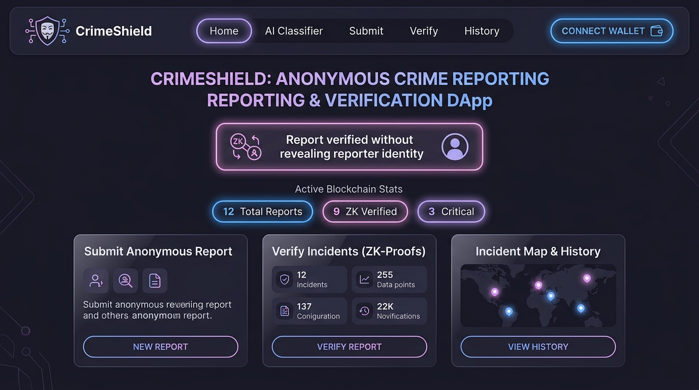
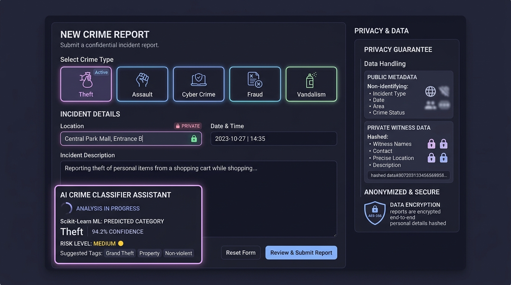
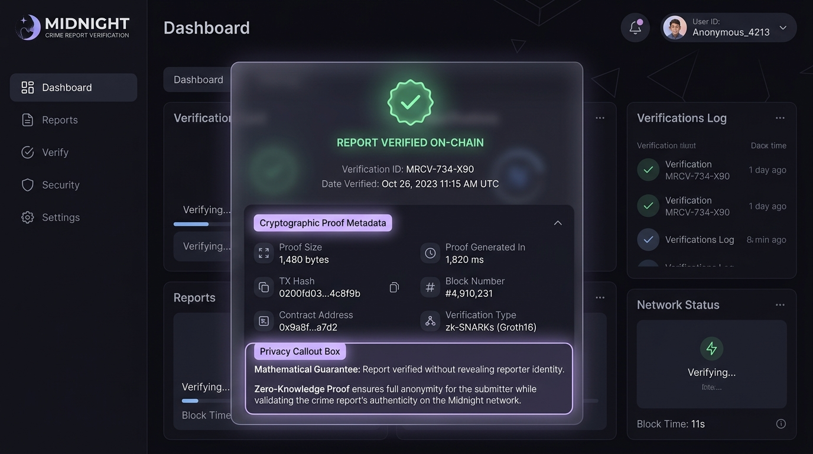
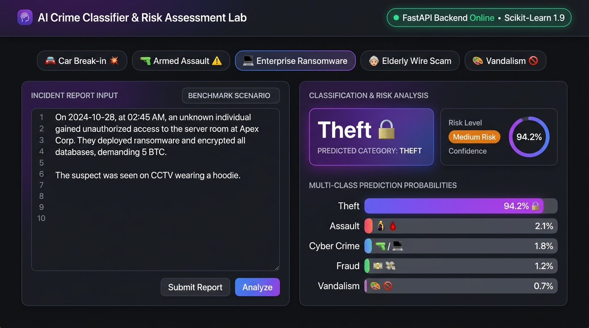
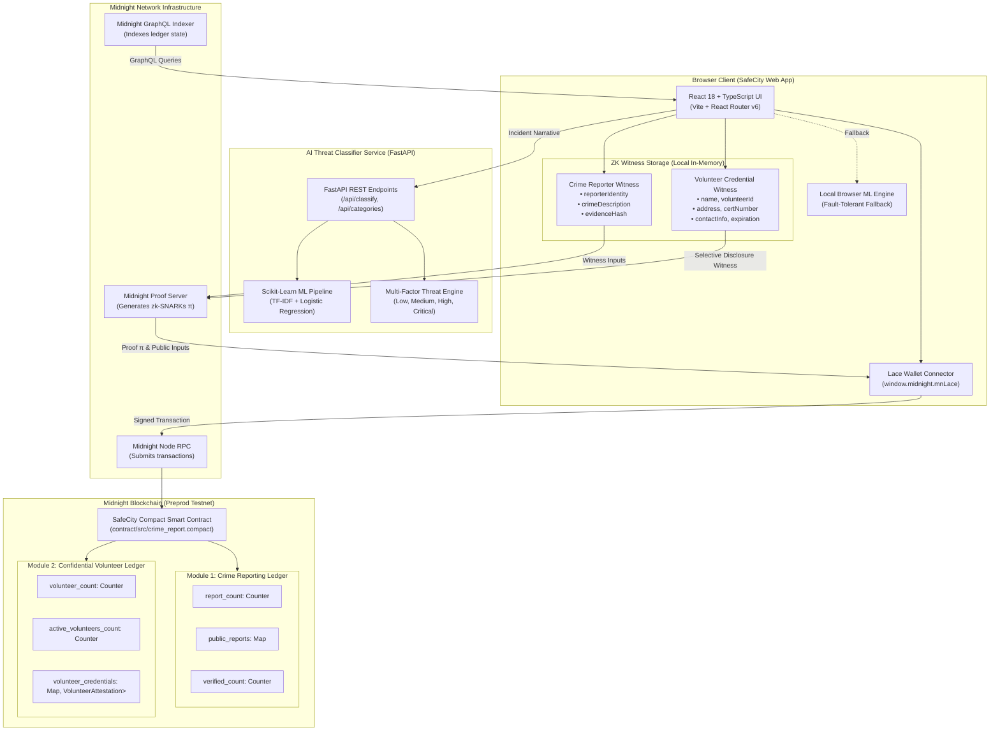

# 🛡️ SafeCity: Decentralized Confidential Public Safety Platform

> **Midnight Blockchain Level 2 — Waxing Crescent Multi-Module Platform**
>
> A production-grade, multi-module public safety platform built on the **Midnight Blockchain** integrating:
> 1. **Zero-Knowledge Anonymous Crime Reporting** with real-time **Scikit-Learn + FastAPI AI threat classification**.
> 2. **Confidential Volunteer Verification** utilizing Midnight private state witnesses and **selective disclosure** principles.
>
> Mathematical zero-knowledge proofs guarantee reporter and volunteer identities are **impossible to reveal**.

[](https://github.com/gourish02/Anonymous-Crime-Reporting/actions/workflows/ci.yml)
[](https://github.com/gourish02/Anonymous-Crime-Reporting/actions/workflows/deploy-contract.yml)
[](https://midnight.network)
[](LICENSE)
[](CONTRIBUTING.md)

---

### 🌐 Preprod Deployed Contract

| Parameter | Value |
|---|---|
| **Platform** | SafeCity Decentralized Public Safety Platform |
| **Network** | Midnight Preprod Testnet (`testnet-02`) |
| **Contract Address** | [`0200fd03c98cb6cccd46085adb1f1bfc68841d3725bd6cbecf0d265f94099a0e`](https://explorer.testnet-02.midnight.network/contract/0200fd03c98cb6cccd46085adb1f1bfc68841d3725bd6cbecf0d265f94099a0e) |
| **Status** | 🟢 Deployed & Verified On-Chain |
| **Module 1 Circuits** | `submitCrimeReport`, `verifyReport`, `getReportStatus`, `updateReportStatus`, `upvoteReport` |
| **Module 2 Circuits** | `submitVolunteerCredential`, `verifyVolunteerCredential`, `getVerificationStatus`, `registerVolunteerCredential`, `proveVolunteerEligibility` |
| **Block Explorer** | [View on Midnight Explorer](https://explorer.testnet-02.midnight.network/contract/0200fd03c98cb6cccd46085adb1f1bfc68841d3725bd6cbecf0d265f94099a0e) |

---

## 🏛️ Platform Modules

```
                    ┌─────────────────────────────────────────┐
                    │     SafeCity Public Safety Platform     │
                    └────────────────────┬────────────────────┘
                                         │
                 ┌───────────────────────┴───────────────────────┐
                 │                                               │
                 ▼                                               ▼
   ┌───────────────────────────┐                   ┌───────────────────────────┐
   │         MODULE 1          │                   │         MODULE 2          │
   │  Anonymous Crime Report   │                   │  Confidential Volunteer   │
   │       & AI Classifier     │                   │       Verification        │
   ├───────────────────────────┤                   ├───────────────────────────┤
   │ • Lace Wallet Integration │                   │ • Selective Disclosure    │
   │ • Compact ZK Circuits     │                   │ • Private Witness State   │
   │ • Scikit-Learn ML Backend │                   │ • Conceals all 5 PII vars │
   │ • Community Upvoting      │                   │ • Reveals Active/Expired  │
   └───────────────────────────┘                   └───────────────────────────┘
```

### Module 1: Anonymous Crime Reporting & AI Classifier
- **Zero-Knowledge Whistleblower Protection**: Citizens file crime reports anonymously. The smart contract mathematically verifies the submission is valid without logging wallet identity or raw text on-chain.
- **FastAPI + Scikit-Learn AI Threat Classifier**: Live categorization across 5 categories (`Theft`, `Assault`, `Cyber Crime`, `Fraud`, `Vandalism`) with calibrated probability scores and multi-factor risk assessment (`Low`, `Medium`, `High`, `Critical`).
- **Community Corroboration**: Tamper-proof upvoting and status verification.

### Module 2: Confidential Volunteer Verification (NEW)
- **Problem**: Volunteers (first responders, medics, search & rescue, disaster relief) need to prove they hold legitimate, unexpired credentials without exposing personal information to public observers.
- **Solution via Midnight Selective Disclosure**:
  - The circuit hides:
    - ❌ Legal Name
    - ❌ Volunteer ID Number
    - ❌ Residential Address
    - ❌ Official Certificate Number
    - ❌ Phone Number & Email
  - The system reveals **ONLY**:
    - ✅ **`Verified / Not Verified`**
    - ✅ **`Certification Active / Expired`**
- **How it Works**: A local cryptographic commitment is computed from private credential fields. The `proveVolunteerEligibility` circuit checks credential validity and evaluates `(expirationTimestamp >= currentTime)` inside the zero-knowledge proof, emitting only binary outcome booleans to the public ledger.

---

## 🧭 Navigation & Page Structure

SafeCity features a modern, responsive navigation bar with the 4 primary destinations:
- **Home (`/`)**: Dual-module landing dashboard, live platform telemetry, and fast action launchpads.
- **Crime Reporting (`/crime`)**: Whistleblower crime portal, preserving all existing reporting workflows:
  - **Submit Crime Report (`/submit`)**: Private witness inputs, AI crime classifier assistant, and ZK proof generation.
  - **Crime Report Verification (`/verify`)**: Check public ledger verification status and corroborated attestations.
  - **Report History (`/history`)**: Real-time ledger history and citizen corroboration upvotes.
  - **AI Threat Classifier Lab (`/classifier`)**: Scikit-Learn ML threat categorization lab with probability distributions.
- **Volunteer Verification (`/volunteer`)**: Confidential credential verification hub with selective disclosure:
  - **Credential Submission (`/volunteer/submit`)**: Private witness inputs (Name, ID, Address, Certificate No., Contact, Expiry) hashed locally into a commitment without exposing PII.
  - **Volunteer Verification (`/volunteer/verify`)**: Zero-knowledge proof verification evaluating eligibility and expiration against the Midnight ledger.
- **Dashboard (`/dashboard`, `/safety-dashboard`)**: Comprehensive **Public Safety Dashboard** showcasing:
  - 📊 **5 Core Metrics**: Total Crime Reports, Verified Crime Reports, Total Volunteer Credentials, Active Volunteers, and Expired Credentials.
  - 📈 **Interactive Charts & Cards**: Category taxonomy distribution, volunteer credential health meter, and live on-chain status.
  - 🔒 **Midnight Selective Disclosure Demonstration**: Interactive proof pipeline demonstrating that names, volunteer IDs, addresses, certificate numbers, and contact details are **never** revealed.

---

## 📸 Screenshots

| 1. SafeCity Dashboard & Platform Telemetry | 2. Submit Crime Report with AI Assistant |
|:---:|:---:|
|  |  |
| *Dual-module dashboard, live counters, and wallet integration* | *5 crime categories, private witness fields & AI classifier* |

| 3. On-Chain ZK Report Verification | 4. AI Crime Classifier Lab |
|:---:|:---:|
|  |  |
| *Verified on-chain without revealing reporter identity* | *Multi-class probabilities & multi-factor threat engine* |

> 🔍 Detailed UI walkthroughs available in [**docs/SCREENSHOTS.md**](docs/SCREENSHOTS.md).

---

## 🔒 Observable Privacy Behavior & Selective Disclosure

Midnight's dual-state ledger cryptographically isolates sensitive private data from public ledger inspection:

| Domain | Attribute | Storage / Handling | On-Chain Visibility |
|---|---|---|:---:|
| **Crime Report** | Reporter Wallet Address | In-Memory Local Witness | ❌ Hidden |
| **Crime Report** | Raw Description & Location | In-Memory Local Witness | ❌ Hidden |
| **Crime Report** | Report ID & Category | Public Ledger Map | ✅ Public |
| **Crime Report** | Verification Status | Public Ledger Map | ✅ Public (`Pending`, `Verified`, `Rejected`) |
| **Volunteer Credential** | Volunteer Full Name | In-Memory Local Witness | ❌ Hidden |
| **Volunteer Credential** | Volunteer ID Number | In-Memory Local Witness | ❌ Hidden |
| **Volunteer Credential** | Residential Address | In-Memory Local Witness | ❌ Hidden |
| **Volunteer Credential** | Official Certificate No. | In-Memory Local Witness | ❌ Hidden |
| **Volunteer Credential** | Contact Info (Phone/Email) | In-Memory Local Witness | ❌ Hidden |
| **Volunteer Credential** | Exact Expiration Date | Evaluated inside ZK Circuit | ❌ Hidden |
| **Volunteer Credential** | Credential Validity | Public Ledger Map | ✅ **`Verified / Not Verified`** |
| **Volunteer Credential** | Certification State | Public Ledger Map | ✅ **`Certification Active / Expired`** |

---

## 🏛️ System Architecture



> 📖 Read full architectural documentation in [**docs/ARCHITECTURE.md**](docs/ARCHITECTURE.md).

---

## 📂 Project Structure

```
anonymous-crime-reporting-dapp/
├── backend/                        # Python FastAPI + Scikit-Learn service
│   ├── model/                      # Trained model artifact & metadata
│   ├── classifier.py               # Inference & multi-factor risk assessment engine
│   ├── data.py                     # Curated dataset for 5 crime categories
│   ├── main.py                     # FastAPI REST API endpoints
│   ├── requirements.txt            # Python dependencies (scikit-learn, fastapi, uvicorn)
│   ├── run.py                      # Uvicorn server runner
│   ├── test_api.py                 # FastAPI integration test suite
│   ├── test_classifier.py          # ML classifier unit tests
│   └── train.py                    # Scikit-Learn training pipeline
├── contract/                       # Midnight Compact Smart Contract
│   ├── src/
│   │   └── crime_report.compact    # Compact contract (Module 1 & Module 2 circuits)
│   └── package.json                # Compact build configuration
├── deploy/                         # Automated deployment scripts
│   └── deploy.mjs                  # Preprod / DevNet contract deployment script
├── devnet/                         # Local DevNet configuration
│   └── docker-compose.yml          # Local Midnight node, indexer & proof server
├── docs/                           # Documentation & Visual Assets
│   ├── screenshots/                # High-resolution application screenshots
│   ├── ARCHITECTURE.md             # Multi-module architecture & selective disclosure flow
│   ├── DEPLOYMENT.md               # Contract deployment guide
│   └── SCREENSHOTS.md              # Detailed UI walkthrough
├── src/                            # React 18 + TypeScript Frontend
│   ├── api/                        # Midnight.js DApp connector, volunteer API & AI client
│   │   ├── volunteer.ts            # Module 2 selective disclosure & commitment API
│   │   ├── midnight.ts             # Midnight.js SDK & Lace integration
│   │   ├── classifierApi.ts        # FastAPI client with browser fallback
│   │   └── mockMidnight.ts         # Preprod simulated client
│   ├── components/                 # UI components, Navbar, AICrimeAssistant
│   ├── config/                     # Network configurations (Preprod & Devnet)
│   ├── context/                    # AppContext global state & wallet hooks
│   ├── pages/                      # Upgraded multi-module pages & dashboards
│   │   ├── HomePage.tsx            # SafeCity dual-module landing dashboard
│   │   ├── CrimeReportingPortalPage.tsx # Crime Reporting portal & sub-navigation
│   │   ├── SubmitReportPage.tsx    # Anonymous crime submission form
│   │   ├── VerificationPage.tsx    # Crime report verification
│   │   ├── ClassifierPage.tsx      # AI classifier lab
│   │   ├── HistoryPage.tsx         # Ledger history
│   │   ├── VolunteerVerificationPage.tsx # Volunteer Verification portal & tabs
│   │   ├── CredentialSubmissionPage.tsx # Confidential Credential Submission form
│   │   ├── VerificationResultPage.tsx # Verification Result ('✓ Verified Volunteer')
│   │   └── PublicSafetyDashboardPage.tsx # Public Safety Dashboard (Charts, Cards & Selective Disclosure)
│   ├── types/                      # Shared TypeScript definitions
│   ├── App.tsx                     # React Router v6 routing (Home, Crime, Volunteer, Dashboard)
│   ├── index.css                   # Catppuccin Mocha design system
│   └── main.tsx                    # React application entry point
├── .env.example                    # Environment variables template
├── CONTRIBUTING.md                 # Contributor guide & commit conventions
├── LICENSE                         # MIT License
├── package.json                    # Frontend dependencies & npm scripts
├── tsconfig.json                   # TypeScript compiler options
├── vercel.json                     # Vercel deployment configuration
└── vite.config.ts                  # Vite build configuration
```

---

## 🚀 Quick Start

### Prerequisites
- **Node.js**: v18.0.0 or v20.x
- **Python**: v3.10+
- **Lace Wallet**: Midnight-compatible browser extension

### 1. Clone & Configure
```bash
git clone https://github.com/gourish02/Anonymous-Crime-Reporting.git
cd Anonymous-Crime-Reporting
cp .env.example .env
```

### 2. Install Dependencies
```bash
# Frontend dependencies
npm install

# Python AI backend dependencies
pip install -r backend/requirements.txt
```

### 3. Run Locally
```bash
# Terminal 1: Start FastAPI AI Backend (port 8000)
npm run ai:server
# or: python backend/run.py

# Terminal 2: Start Vite Frontend (port 3000)
npm run dev
```

### 4. Run Automated Tests
```bash
# Frontend type check & tests
npm run type-check
npm test

# Python AI classifier & FastAPI tests
npm run ai:test
```

---

## 📜 Available Scripts

| Command | Description |
|---|---|
| `npm run dev` | Start Vite dev server on `http://localhost:3000` |
| `npm run build` | Compile TypeScript and bundle frontend for production |
| `npm run preview` | Locally preview production bundle |
| `npm run type-check` | Run TypeScript strict compiler check (`tsc --noEmit`) |
| `npm run lint` | Run ESLint across all TypeScript and TSX files |
| `npm test` | Run Vitest unit tests |
| `npm run ai:train` | Run Scikit-Learn training pipeline (`backend/train.py`) |
| `npm run ai:test` | Run ML classifier & FastAPI unit/integration tests |
| `npm run ai:server` | Start FastAPI server on port 8000 (`backend/run.py`) |

---

## 🤝 Contributing

Contributions are welcome! Please read our [**CONTRIBUTING.md**](CONTRIBUTING.md) guide for information on branching, commit conventions, local testing, and pull requests.

---

## 📄 License

This project is open source and available under the [**MIT License**](LICENSE).
