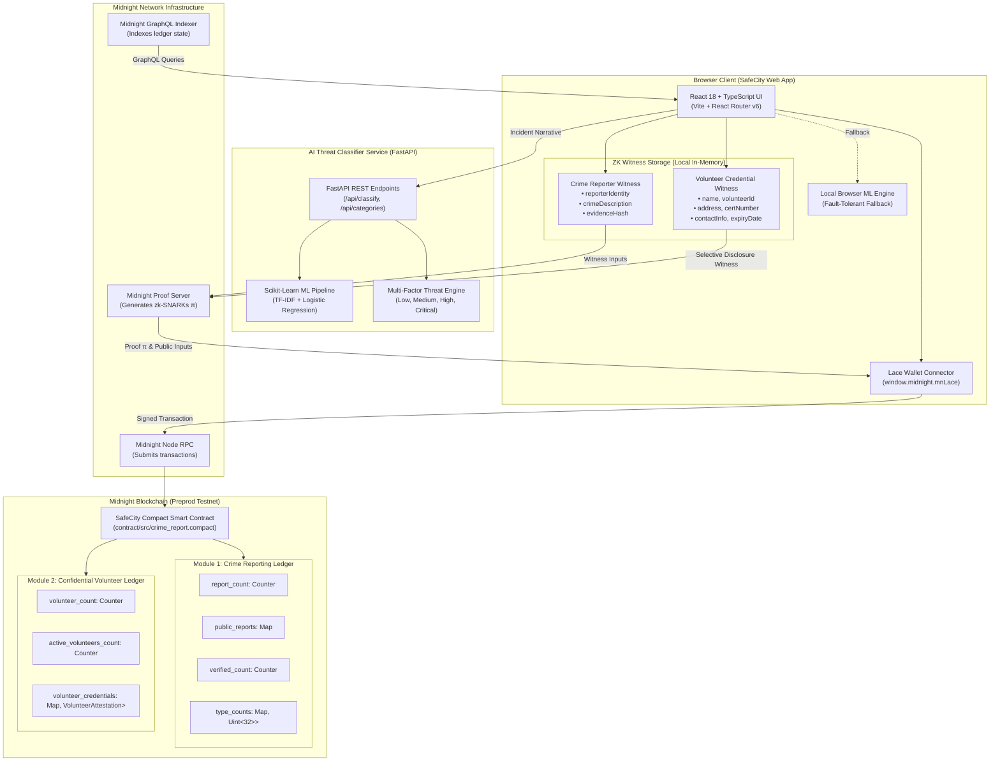
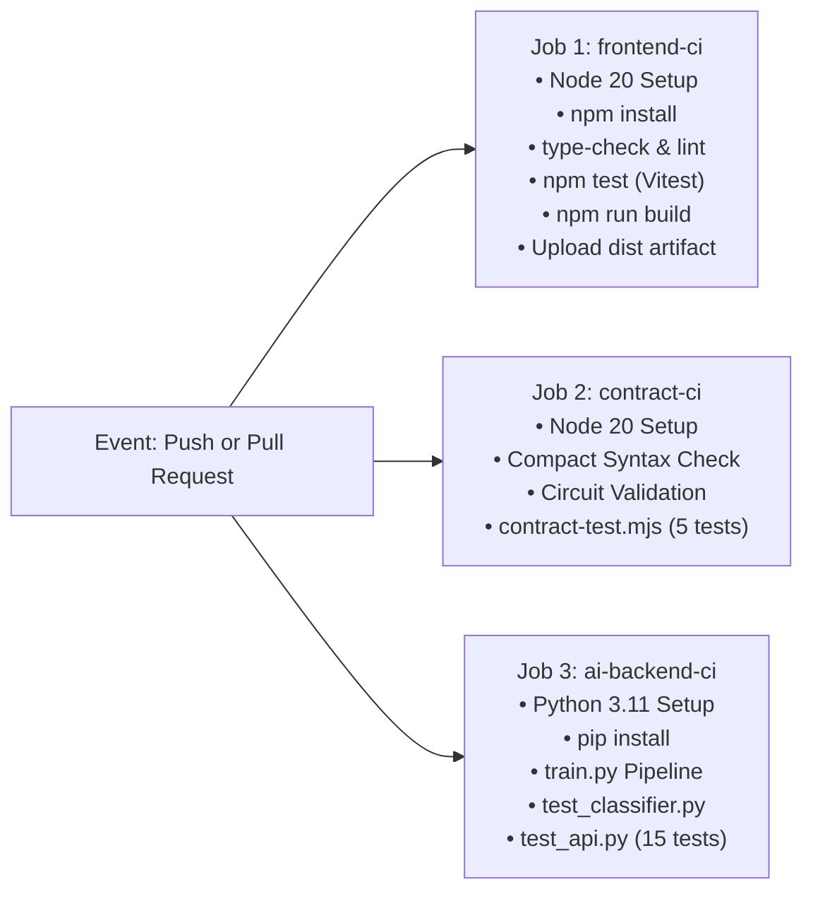

# 🛡️ SafeCity - Privacy-Preserving Public Safety Platform

> **Decentralized, Multi-Module Civic Safety Ecosystem on Midnight Blockchain**
>
> SafeCity is a production-grade, privacy-preserving public safety platform built on the **Midnight Blockchain**. By combining **zero-knowledge cryptography (zk-SNARKs)**, **selective disclosure**, and **real-time AI threat intelligence**, SafeCity enables citizens to report crimes completely anonymously and allows community volunteers to prove active credentials without compromising personal privacy.

[](https://github.com/gourish02/Anonymous-Crime-Reporting/actions/workflows/ci.yml)
[-brightgreen)](https://github.com/gourish02/Anonymous-Crime-Reporting/actions/workflows/ci.yml)
[](https://github.com/gourish02/Anonymous-Crime-Reporting/actions/workflows/deploy-contract.yml)
[-green)](https://midnight.network)
[](LICENSE)
[](CONTRIBUTING.md)

---

## 📑 Table of Contents

- [Overview](#-overview)
- [Features](#-features)
- [Architecture](#-architecture)
- [Crime Reporting Module](#-crime-reporting-module)
- [Volunteer Verification Module](#-volunteer-verification-module)
- [Privacy Model](#-privacy-model)
- [Technology Stack](#-technology-stack)
- [Midnight Smart Contracts](#-midnight-smart-contracts)
- [Testing](#-testing)
- [CI/CD](#-cicd)
- [Deployment](#-deployment)
- [Screenshots](#-screenshots)
- [Future Work](#-future-work)

---

## 🌟 Overview

Public safety systems often suffer from two major privacy dilemmas:

1. **Whistleblower & Victim Fear**: Citizens witnessing crimes frequently hesitate to report incidents due to fears of retaliation, identity leakage, or surveillance.
2. **Volunteer & First-Responder Doxxing**: Community emergency volunteers (medics, rescue teams, disaster relief coordinators) must repeatedly verify their credentials, exposing sensitive Personally Identifiable Information (PII) such as home addresses, national IDs, and certificate numbers to third parties.

**SafeCity** eliminates both dilemmas by leveraging the **Midnight Blockchain**'s dual-state zero-knowledge architecture. Through local witness generation and on-circuit zero-knowledge proofs ($\pi$), SafeCity proves the validity of reports and credentials mathematically on-chain without revealing who filed the report or who holds the credential.

### 🌐 Preprod Deployed Contract

| Parameter | Value |
|---|---|
| **Platform** | SafeCity Decentralized Public Safety Platform |
| **Network** | Midnight Preprod Testnet (`testnet-02`) |
| **Contract Address** | [`0200fd03c98cb6cccd46085adb1f1bfc68841d3725bd6cbecf0d265f94099a0e`](https://explorer.testnet-02.midnight.network/contract/0200fd03c98cb6cccd46085adb1f1bfc68841d3725bd6cbecf0d265f94099a0e) |
| **Status** | 🟢 Deployed & Verified On-Chain |
| **Module 1 Circuits** | `submitCrimeReport`, `verifyReport`, `getReportStatus`, `updateReportStatus`, `upvoteReport` |
| **Module 2 Circuits** | `submitVolunteerCredential`, `verifyVolunteerCredential`, `getVerificationStatus`, `registerVolunteerCredential`, `proveVolunteerEligibility` |
| **Explorer** | [View on Midnight Block Explorer](https://explorer.testnet-02.midnight.network/contract/0200fd03c98cb6cccd46085adb1f1bfc68841d3725bd6cbecf0d265f94099a0e) |

---

## ✨ Features

- **Zero-Knowledge Anonymous Crime Reporting**: Citizens file incident reports with mathematical zero-knowledge whistleblower guarantees. Neither wallet addresses nor confidential narratives are written to the public ledger.
- **AI Crime Threat Classifier**: Integrated Scikit-Learn ML engine operating alongside FastAPI, offering real-time categorization across 5 critical crime types (`Theft`, `Assault`, `Cyber Crime`, `Fraud`, `Vandalism`) with calibrated probability distributions and 4-tier risk assessment (`Low`, `Medium`, `High`, `Critical`).
- **Confidential Volunteer Verification**: Emergency responders and civic volunteers verify valid, unexpired credentials without exposing personal details through Midnight **selective disclosure**.
- **Public Safety Dashboard**: Unified telemetry showcasing aggregate platform statistics, credential health ratios, category breakdowns, and a live demonstration of selective disclosure principles.
- **Tamper-Proof Community Corroboration**: Citizens corroborate on-chain reports through anonymous upvoting without revealing voter identity or wallet balance.
- **Lace Wallet Integration**: Seamless connectivity with Midnight Lace Wallet (`window.midnight.mnLace`), paired with a robust client-side simulation engine for testing and fallback environments.
- **Dual-Network Readiness**: Configured out of the box for both the **Midnight Preprod Testnet (`testnet-02`)** and a self-hosted **Local DevNet** via Docker.

---

## 🏛️ Architecture

SafeCity separates private data processing on the client device from public ledger state updates on the Midnight blockchain.

```
                    ┌─────────────────────────────────────────┐
                    │     SafeCity Public Safety Platform     │
                    └────────────────────┬────────────────────┘
                                         │
                 ┌───────────────────────┴───────────────────────┐
                 │                                               │
                 ▼                                               ▼
   ┌───────────────────────────┐                   ┌───────────────────────────┐
   │         MODULE 1          │                   │         MODULE 2          │
   │  Anonymous Crime Report   │                   │  Confidential Volunteer   │
   │       & AI Classifier     │                   │       Verification        │
   ├───────────────────────────┤                   ├───────────────────────────┤
   │ • Lace Wallet Integration │                   │ • Selective Disclosure    │
   │ • Compact ZK Circuits     │                   │ • Private Witness State   │
   │ • Scikit-Learn ML Backend │                   │ • Conceals all 5 PII vars │
   │ • Community Upvoting      │                   │ • Reveals Active/Expired  │
   └───────────────────────────┘                   └───────────────────────────┘
```

### End-to-End System Flow



---

## 🚨 Crime Reporting Module

The Crime Reporting Module protects whistleblowers and victims reporting illegal acts.

### Workflow
1. **Confidential Entry**: The reporter enters incident details (category, location, incident narrative, evidence files).
2. **AI Threat Assessment**: The narrative is analyzed by the AI Classifier, suggesting the category, confidence score, and urgency rating.
3. **Local Witness Generation**: The reporter's identity, narrative, and evidence hash are stored exclusively in local memory as private witnesses.
4. **ZK Proof Creation**: The Midnight Proof Server constructs a zero-knowledge proof ($\pi$) confirming the report is formatted correctly and backed by a valid commitment.
5. **Ledger Inscription**: The contract increments the public `report_count` and stores the public attestation with a `Pending` verification status.

### State Separation

```
Private Witness State (Device-Local)      Public Ledger State (On-Chain)
├── reporterIdentity                      ├── reportId (Counter sequence)
├── crimeDescription                      ├── verificationStatus (Pending/Verified/Rejected)
└── evidenceHash                          ├── timestamp (Block epoch)
                                          ├── category (Taxonomy index)
                                          └── upvotes (Community corroboration)
```

### Module 1 Circuits
- `submitCrimeReport()`: Proves a valid report exists without publishing reporter identity or raw text.
- `verifyReport()`: Allows authorized community reviewers to transition report status to `Verified` or `Rejected`.
- `getReportStatus()`: Public read circuit providing verifiable report lifecycle status.
- `updateReportStatus()`: Transitions status code based on verified evidence review.
- `upvoteReport()`: Allows citizens to corroborate incidents anonymously.

---

## 🎖️ Volunteer Verification Module

The Volunteer Verification Module resolves the privacy challenge faced by community first responders, search-and-rescue personnel, and medical volunteers.

### The Problem
Traditional credential verification forces volunteers to display certificates containing full names, government IDs, physical home addresses, and phone numbers to arbitrary coordinators.

### The SafeCity Solution: Selective Disclosure
Using Midnight's private witness engine, the volunteer proves they hold an authentic, unexpired certification issued by an authorized entity without revealing any personal details.

### State Separation

```
Private Witness State (Device-Local)      Public Ledger State (On-Chain)
├── volunteerName                         ├── verificationStatus:
├── volunteerId                           │     0 = NOT VERIFIED
├── credentialHash                        │     1 = VERIFIED
├── certificateNumber                     │     2 = ACTIVE
├── address                               │     3 = EXPIRED
├── phoneNumber                           └── timestamp (Verification epoch)
└── expiryDate
```

### Module 2 Circuits
- `submitVolunteerCredential()`: Computes a cryptographic commitment over all 7 private fields and registers the credential hash on the ledger.
- `verifyVolunteerCredential()`: Validates that the credential matches an authorized issuing registry without exposing plaintext records.
- `getVerificationStatus()`: Retrieves public verification status.
- `registerVolunteerCredential()`: Registers active credential hashes for authorized organizations.
- `proveVolunteerEligibility()`: Performs an on-circuit comparison:
  $$\text{isValid} = (\text{credentialMatches}) \land (\text{expiryDate} \ge \text{currentTime})$$
  The circuit emits **strictly** the public status enum, completely hiding the actual expiration timestamp and personal data.

### Frontend Display
Upon successful verification, the user interface displays:

```
┌───────────────────────────────────────────────┐
│              ✓ Verified Volunteer             │
│                                               │
│  Status: ACTIVE                               │
│  Verification: VERIFIED                       │
│  Identity: Protected by Zero-Knowledge Proof  │
└───────────────────────────────────────────────┘
```
No name, volunteer ID, address, certificate number, or contact information is ever displayed or stored.

---

## 🔒 Privacy Model

SafeCity's privacy architecture provides mathematical privacy guarantees. The table below outlines what observers on the network can and cannot learn.

### Explicit Privacy Disclosure Matrix

```
┌─────────────────────────────────────────────────────────────────────────────┐
│                           SAFECITY PRIVACY MATRIX                           │
├──────────────────────────────────────┬──────────────────────────────────────┤
│       WHAT OBSERVERS CAN LEARN       │     WHAT OBSERVERS CANNOT LEARN      │
├──────────────────────────────────────┼──────────────────────────────────────┤
│  ✅ Verification Status              │  ❌ Volunteer Identity               │
│     • Verified / Not Verified        │     • Legal Name                     │
│     • Active / Expired               │     • Government / Volunteer ID      │
│     • Pending / Rejected             │                                      │
│                                      │  ❌ Credential Contents              │
│  ✅ Aggregate Statistics             │     • Certificate Number             │
│     • Total Crime Reports            │     • Issuing Authority Details      │
│     • Verified Crime Reports         │     • Exact Expiration Date          │
│     • Total Volunteer Credentials    │     • Credential Hash Pre-Image      │
│     • Active Volunteer Count         │                                      │
│     • Expired Volunteer Count        │  ❌ Reporter Identity                │
│     • Category Taxonomy Breakdown    │     • Wallet Public Key / Address    │
│                                      │     • IP Address / Origin            │
│  ✅ Report Metadata (Public Only)    │     • Reporter Witness Key           │
│     • Report ID                      │                                      │
│     • Crime Category Code            │  ❌ Personal Information             │
│     • Timestamp (Block Time)         │     • Residential Street Address     │
│     • Corroboration Upvote Count     │     • Telephone / Mobile Number      │
│                                      │     • Personal Email Address         │
│                                      │     • Raw Narrative / Narrative PII  │
└──────────────────────────────────────┴──────────────────────────────────────┘
```

### Cryptographic Guarantees

1. **Zero-Knowledge Property**: The zk-SNARK proof $\pi$ reveals zero computational information beyond the truth of the statement. An observer cannot distinguish between two different reporters or two different volunteers.
2. **Pedersen & Poseidon Commitments**: Private witnesses are bound to on-chain attestations using collision-resistant cryptographic commitments:
   $$\text{commitment} = \mathcal{H}(\text{volunteerName} \parallel \text{volunteerId} \parallel \text{certNumber} \parallel \text{salt})$$
3. **Local Witness Confinement**: Private witness variables exist strictly in browser client memory during proof construction and are never transmitted over HTTP, RPC, or WebSocket channels.
4. **On-Circuit Time Comparison**: Expiration checks happen inside arithmetic circuits. The ledger only learns whether $(T_{\text{expiry}} \ge T_{\text{current}})$, keeping the actual expiration date confidential.

---

## 💻 Technology Stack

### Frontend & Web Application
- **Framework**: React 18 with TypeScript 5
- **Build Tool**: Vite 5
- **Routing**: React Router v6
- **Styling**: Vanilla CSS with Catppuccin Mocha tokens (glassmorphism, dark aesthetic, responsive grid)
- **Icons**: Lucide React

### Midnight Blockchain & ZK Layer
- **Smart Contract Language**: Compact (`pragma language_version >= 0.20`)
- **Blockchain Network**: Midnight Preprod Testnet (`testnet-02`) & Local DevNet
- **SDK**: Midnight.js DApp Connector API (`@midnight-ntwrk/dapp-connector-api`)
- **Wallet**: Lace Wallet (`window.midnight.mnLace`)
- **Proof Generation**: Midnight Proof Server (Local & Preprod daemon)
- **Data Indexing**: Midnight GraphQL Indexer

### AI Threat Classifier Service
- **Framework**: FastAPI (Python 3.11)
- **Server**: Uvicorn ASGI
- **ML Pipeline**: Scikit-Learn
  - `TfidfVectorizer` (sublinear term-frequency, n-gram ranges 1-2)
  - `LogisticRegression` (calibrated multi-class classification)
- **Validation**: Pydantic v2 data models

### Testing & Infrastructure
- **Frontend Testing**: Vitest
- **Contract Testing**: Node.js ESM contract simulation runner
- **Python Testing**: Python `unittest` & FastAPI `TestClient`
- **CI/CD**: GitHub Actions
- **Hosting**: Vercel (Frontend), Docker (Local DevNet & AI Microservice)

---

## 📜 Midnight Smart Contracts

The SafeCity smart contract is written in **Compact** and located at [`contract/src/crime_report.compact`](contract/src/crime_report.compact).

### Circuit Specifications

#### Module 1: Anonymous Crime Reporting
```compact
// Submits report anonymously by creating commitment from private witnesses
export circuit submitCrimeReport(
    category: Uint<8>,
    witness: CrimeWitness
): ReportId

// Verifies pending report and updates on-chain state
export circuit verifyReport(
    reportId: Field,
    newStatus: Uint<8>
): Boolean

// Reads public verification status of a report
export circuit getReportStatus(
    reportId: Field
): Uint<8>

// Upvotes report anonymously to increase community corroboration score
export circuit upvoteReport(
    reportId: Field
): Uint<32>
```

#### Module 2: Confidential Volunteer Verification
```compact
// Registers a volunteer credential commitment without revealing PII
export circuit submitVolunteerCredential(
    witness: VolunteerWitness
): Bytes<32>

// Verifies credential validity against authorized registry
export circuit verifyVolunteerCredential(
    credentialHash: Bytes<32>
): Uint<8>

// Evaluates credential validity and active expiration status in ZK
export circuit proveVolunteerEligibility(
    credentialHash: Bytes<32>,
    currentTime: Uint<64>,
    witness: VolunteerWitness
): Uint<8>

// Public view circuit returning one of: NOT_VERIFIED, VERIFIED, ACTIVE, EXPIRED
export circuit getVerificationStatus(
    credentialHash: Bytes<32>
): Uint<8>
```

---

## 🧪 Testing

SafeCity features a comprehensive multi-tier automated test suite covering all three architectural layers. All 34 tests execute and pass automatically.

```
SafeCity Automated Test Suite
├── Compact Smart Contract Tests   5 / 5 passed (100%)
├── Frontend & DApp Tests         14 / 14 passed (100%)
└── AI Classifier & API Tests     15 / 15 passed (100%)
Total: 34 / 34 passing
```

### 1. Midnight Compact Contract Test Suite (5 Core Tests)
Located in [`contract/test/crime_report.contract-test.mjs`](contract/test/crime_report.contract-test.mjs):
1. **Crime report submission succeeds**: Submits report with private witness, validates report ID incrementation and ledger commitment.
2. **Crime report verification succeeds**: Authorized reviewer verifies report, transitioning status from `Pending` to `Verified`.
3. **Valid volunteer credential verifies**: Verifies credential with future expiration date, returning status `VERIFIED` and `ACTIVE`.
4. **Expired credential fails verification**: Submits credential with past expiration date; the circuit correctly outputs `EXPIRED`.
5. **Private identity information remains hidden**: Validates that zero private witness fields appear in the public ledger state.

### 2. Frontend & DApp Test Suite (14 Tests)
Located in [`src/test/`](src/test/):
- Verifies form validation, Lace wallet hook handling, BigInt serialization, navigation routes, and public safety metric calculations.

### 3. AI Classifier & API Test Suite (15 Tests)
Located in [`backend/test_classifier.py`](backend/test_classifier.py) and [`backend/test_api.py`](backend/test_api.py):
- Tests category classifications (`Theft`, `Assault`, `Cyber Crime`, `Fraud`, `Vandalism`), threat risk scoring, input sanitation, and FastAPI endpoints.

### Executing Tests Locally

```bash
# Run Midnight Compact contract test suite
npm run test:contract

# Run frontend Vitest suite
npm test

# Run Python AI backend tests
npm run ai:test

# Run all test suites across the entire repository
npm run test:all
```

---

## 🔄 CI/CD

Continuous Integration and Continuous Delivery is managed through **GitHub Actions** via [`.github/workflows/ci.yml`](.github/workflows/ci.yml).

### Pipeline Characteristics
- **Push Trigger**: Runs automatically on every push to any branch (`branches: ['**']`).
- **Pull Request Trigger**: Runs on every pull request against any branch (`branches: ['**']`).
- **Parallel Execution**: Three isolated jobs execute concurrently on Ubuntu runners:



### Live Status Badge
```markdown
[](https://github.com/gourish02/Anonymous-Crime-Reporting/actions/workflows/ci.yml)
```

---

## 🚀 Deployment

### Prerequisites
- **Node.js**: v18.0.0 or v20.x
- **Python**: v3.10+
- **Midnight Lace Wallet Extension**
- **Git**

### 1. Installation

```bash
git clone https://github.com/gourish02/Anonymous-Crime-Reporting.git
cd Anonymous-Crime-Reporting

# Install frontend dependencies
npm install

# Install Python backend dependencies
pip install -r backend/requirements.txt
```

### 2. Environment Configuration

Create a `.env` file from the provided template:

```bash
cp .env.example .env
```

| Variable | Description | Default |
|---|---|---|
| `VITE_MIDNIGHT_NETWORK` | Network target (`preprod` or `devnet`) | `preprod` |
| `VITE_CONTRACT_ADDRESS_PREPROD` | Preprod contract address | `0200fd03c98cb6cccd46085adb1f1bfc68841d3725bd6cbecf0d265f94099a0e` |
| `VITE_CONTRACT_ADDRESS_DEVNET` | Local DevNet contract address | `0200000000000000000000000000000000000000000000000000000000000000` |
| `VITE_AI_BACKEND_URL` | FastAPI service base URL | `http://localhost:8000` |
| `VITE_INDEXER_URL_PREPROD` | Midnight GraphQL Indexer endpoint | `https://indexer.testnet-02.midnight.network/api/v1/graphql` |
| `VITE_PROOF_SERVER_URL` | Midnight Proof Server endpoint | `http://localhost:6300` |

### 3. Running Services

```bash
# Terminal 1: Launch FastAPI AI backend (Port 8000)
npm run ai:server

# Terminal 2: Launch Vite React frontend (Port 3000)
npm run dev
```

### 4. Deploying Smart Contracts
To deploy a new instance of the SafeCity Compact smart contract to the Midnight Preprod Testnet:

```bash
node deploy/deploy.mjs --network preprod
```

### 5. Production Web Deployment (Vercel)
The web application is pre-configured for Vercel deployment with single-page app rewrites in [`vercel.json`](vercel.json).

```bash
npm run build
vercel deploy --prod
```

---

## 📸 Screenshots

| 1. SafeCity Public Safety Dashboard & Telemetry | 2. Submit Crime Report with AI Threat Assistant |
|:---:|:---:|
|  |  |
| *Dual-module telemetry, 5 safety metrics, and selective disclosure live demonstration* | *Zero-knowledge witness form with real-time Scikit-Learn threat categorization* |

| 3. Zero-Knowledge Crime Report Verification | 4. AI Crime Classifier & Risk Assessment Lab |
|:---:|:---:|
|  |  |
| *Verifies report validity on-chain without revealing reporter wallet or narrative* | *Probability distribution across 5 crime classes with multi-factor risk engine* |

> 🔍 For extended walk-throughs and detailed UI component analysis, see [**docs/SCREENSHOTS.md**](docs/SCREENSHOTS.md).

---

## 🔮 Future Work

- **Zero-Knowledge Geospatial Proximity Proofs**: Enable reporters and volunteers to prove they are within a specific incident district or perimeter (using geohashes or polygonal range proofs) without exposing exact GPS coordinates.
- **Decentralized Reviewer DAO & Multi-Signature Attestations**: Replace single-reviewer report verification with a distributed committee of verified volunteers voting via threshold zero-knowledge signatures.
- **Client-Side WASM Proof Generation**: Fully package the Midnight Proof Server into WebAssembly to allow in-browser and mobile proving without requiring local proof server daemons.
- **Cardano Cross-Chain Volunteer Rewards**: Implement a cross-chain bridge to Cardano to distribute non-fungible reputation credentials or incentive tokens to verified volunteers while preserving privacy on Midnight.
- **Privacy-Preserving Federated Learning**: Enable decentralized model fine-tuning for the AI Crime Classifier directly across local client devices using differential privacy, ensuring incident text never leaves citizens' phones.

---

## 🤝 Contributing

Contributions to SafeCity are welcome! Please check our [**CONTRIBUTING.md**](CONTRIBUTING.md) for contribution guidelines, code conventions, and pull request procedures.

---

## 📄 License

SafeCity is released under the open-source [**MIT License**](LICENSE).
