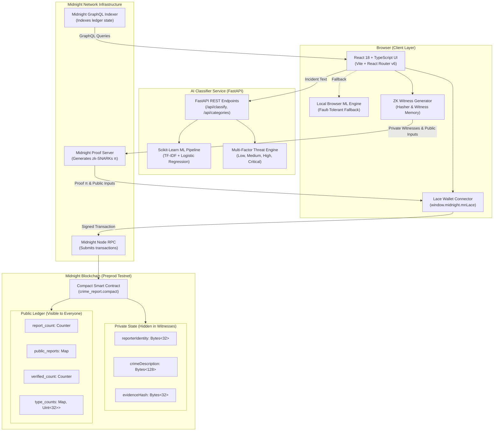

# 🛡️ CrimeShield: Anonymous Crime Reporting & Verification DApp

> **Midnight Blockchain Level 2 — Waxing Crescent Project**
>
> A full-stack, production-grade privacy-preserving dApp built on the **Midnight Blockchain** with an integrated **Scikit-Learn + FastAPI AI Crime Classifier**.
> Zero-knowledge proofs ensure reporter identities are **mathematically impossible to reveal**.

[](https://github.com/gourish02/Anonymous-Crime-Reporting/actions/workflows/ci.yml)
[](https://github.com/gourish02/Anonymous-Crime-Reporting/actions/workflows/deploy-contract.yml)
[](https://midnight.network)
[](LICENSE)
[](CONTRIBUTING.md)

---

### 🌐 Preprod Deployed Contract

| Parameter | Value |
|---|---|
| **Network** | Midnight Preprod Testnet (`testnet-02`) |
| **Contract Address** | [`0200fd03c98cb6cccd46085adb1f1bfc68841d3725bd6cbecf0d265f94099a0e`](https://explorer.testnet-02.midnight.network/contract/0200fd03c98cb6cccd46085adb1f1bfc68841d3725bd6cbecf0d265f94099a0e) |
| **Status** | 🟢 Deployed & Verified On-Chain |
| **Circuits** | `submitCrimeReport`, `verifyReport`, `getReportStatus`, `updateReportStatus`, `upvoteReport` |
| **Block Explorer** | [View on Midnight Explorer](https://explorer.testnet-02.midnight.network/contract/0200fd03c98cb6cccd46085adb1f1bfc68841d3725bd6cbecf0d265f94099a0e) |

---

## 📸 Screenshots

| 1. Landing Page & Network Telemetry | 2. Submit Report with AI Assistant |
|:---:|:---:|
|  |  |
| *Live counters, ZK claim banner, and wallet indicators* | *5 crime categories, private witness fields & AI classifier* |

| 3. On-Chain ZK Verification | 4. AI Crime Classifier Lab |
|:---:|:---:|
|  |  |
| *Verified without revealing reporter identity* | *Multi-class probabilities & multi-factor risk engine* |

> 🔍 View detailed UI breakdowns in [**docs/SCREENSHOTS.md**](docs/SCREENSHOTS.md).

---

## 🏛️ System Architecture



> 📖 Read full architectural documentation in [**docs/ARCHITECTURE.md**](docs/ARCHITECTURE.md).

---

## 🔒 Observable Privacy Behavior

> **"Report verified without revealing reporter identity"**

Midnight's dual-state ledger cryptographically isolates sensitive reporter data from public ledger inspection:

| Data Field | Storage Location | On-Chain State | Accessibility |
|---|---|:---:|---|
| **Reporter Wallet Address** | Browser Witness Memory | ❌ Never Broadcasted | Private to submitter |
| **Exact Incident Location** | Browser Witness Memory | ❌ Never Broadcasted | Hashed locally in browser |
| **Raw Crime Description** | Browser Witness Memory | ❌ Never Broadcasted | Hashed locally in browser |
| **Evidence IPFS / CID** | Browser Witness Memory | ❌ Never Broadcasted | Protected in witness |
| **Report ID** | Public Ledger Map | ✅ Public | Auto-incremented sequence |
| **Crime Type Enum** | Public Ledger Map | ✅ Public | `Theft`, `Assault`, `Cyber Crime`, `Fraud`, `Vandalism` |
| **Submission Timestamp** | Public Ledger Map | ✅ Public | Block inclusion timestamp |
| **Verification Status** | Public Ledger Map | ✅ Public | `Pending (0)`, `Verified (1)`, `Rejected (2)` |

---

## 🤖 AI Crime Classifier Backend

The repository includes a dedicated Machine Learning backend that provides real-time categorization and risk scoring:

- **5 Supported Categories**: Theft, Assault, Cyber Crime, Fraud, Vandalism.
- **Scikit-Learn ML Pipeline**: `TfidfVectorizer` (10,000 n-gram features) + balanced multi-class `LogisticRegression` with calibrated probabilities.
- **Multi-Factor Risk Assessment Engine**:
  - Baseline category risk weight
  - Critical threat indicators (`knife`, `gun`, `shooting`, `bleeding`, `hospital`, `hostage`)
  - High severity modifiers (`punched`, `beaten`, `ransomware`, `fracture`, `wire transfer`)
- **FastAPI Endpoints**: REST API with interactive Swagger UI docs at `http://localhost:8000/docs`.
- **Fault-Tolerant Browser Fallback**: Seamless client-side ML engine activates if backend is offline.

---

## 📂 Project Structure

```
anonymous-crime-reporting-dapp/
├── backend/                        # Python FastAPI + Scikit-Learn service
│   ├── model/                      # Trained model artifact & metadata
│   ├── classifier.py               # Inference & multi-factor risk assessment engine
│   ├── data.py                     # Curated dataset for 5 crime categories
│   ├── main.py                     # FastAPI REST API endpoints
│   ├── requirements.txt            # Python dependencies (scikit-learn, fastapi, uvicorn)
│   ├── run.py                      # Uvicorn server runner
│   ├── test_api.py                 # FastAPI integration test suite
│   ├── test_classifier.py          # ML classifier unit tests
│   └── train.py                    # Scikit-Learn training pipeline
├── contract/                       # Midnight Compact Smart Contract
│   ├── src/
│   │   └── crime_report.compact    # Compact contract (witnesses, circuits, state)
│   └── package.json                # Compact build configuration
├── deploy/                         # Automated deployment scripts
│   └── deploy.mjs                  # Preprod / DevNet contract deployment script
├── devnet/                         # Local DevNet configuration
│   └── docker-compose.yml          # Local Midnight node, indexer & proof server
├── docs/                           # Documentation & Visual Assets
│   ├── screenshots/                # High-resolution application screenshots
│   ├── ARCHITECTURE.md             # System architecture & ZK data flow
│   ├── DEPLOYMENT.md               # Contract deployment guide
│   └── SCREENSHOTS.md              # Detailed UI walkthrough
├── src/                            # React 18 + TypeScript Frontend
│   ├── api/                        # Midnight.js DApp connector & AI API client
│   ├── components/                 # UI widgets, AICrimeAssistant, PrivacyBadge
│   ├── config/                     # Network configurations (Preprod & Devnet)
│   ├── context/                    # AppContext global state & wallet hooks
│   ├── pages/                      # Home, Submit, Verify, History, AI Classifier
│   ├── types/                      # Shared TypeScript definitions
│   ├── App.tsx                     # React Router v6 routing
│   ├── index.css                   # Catppuccin Mocha design system
│   └── main.tsx                    # React application entry point
├── .env.example                    # Environment variables template
├── CONTRIBUTING.md                 # Contributor guide & commit conventions
├── LICENSE                         # MIT License
├── package.json                    # Frontend dependencies & npm scripts
├── tsconfig.json                   # TypeScript compiler options
├── vercel.json                     # Vercel deployment configuration
└── vite.config.ts                  # Vite build configuration
```

---

## 🚀 Quick Start

### Prerequisites
- **Node.js**: v18.0.0 or v20.x
- **Python**: v3.10+
- **Lace Wallet**: Midnight-compatible browser extension

### 1. Clone & Configure
```bash
git clone https://github.com/gourish02/Anonymous-Crime-Reporting.git
cd Anonymous-Crime-Reporting
cp .env.example .env
```

### 2. Install Dependencies
```bash
# Frontend dependencies
npm install

# Python AI backend dependencies
pip install -r backend/requirements.txt
```

### 3. Run Locally
```bash
# Terminal 1: Start FastAPI AI Backend (port 8000)
npm run ai:server
# or: python backend/run.py

# Terminal 2: Start Vite Frontend (port 3000)
npm run dev
```

### 4. Run Automated Tests
```bash
# Frontend type check & tests
npm run type-check
npm test

# Python AI classifier & FastAPI tests
npm run ai:test
```

---

## 📜 Available Scripts

| Command | Description |
|---|---|
| `npm run dev` | Start Vite dev server on `http://localhost:3000` |
| `npm run build` | Compile TypeScript and bundle frontend for production |
| `npm run preview` | Locally preview production bundle |
| `npm run type-check` | Run TypeScript strict compiler check (`tsc --noEmit`) |
| `npm run lint` | Run ESLint across all TypeScript and TSX files |
| `npm test` | Run Vitest unit tests |
| `npm run ai:train` | Run Scikit-Learn training pipeline (`backend/train.py`) |
| `npm run ai:test` | Run ML classifier & FastAPI unit/integration tests |
| `npm run ai:server` | Start FastAPI server on port 8000 (`backend/run.py`) |

---

## 🤝 Contributing

Contributions are welcome! Please read our [**CONTRIBUTING.md**](CONTRIBUTING.md) guide for information on branching, commit conventions, local testing, and pull requests.

---

## 📄 License

This project is open source and available under the [**MIT License**](LICENSE).
