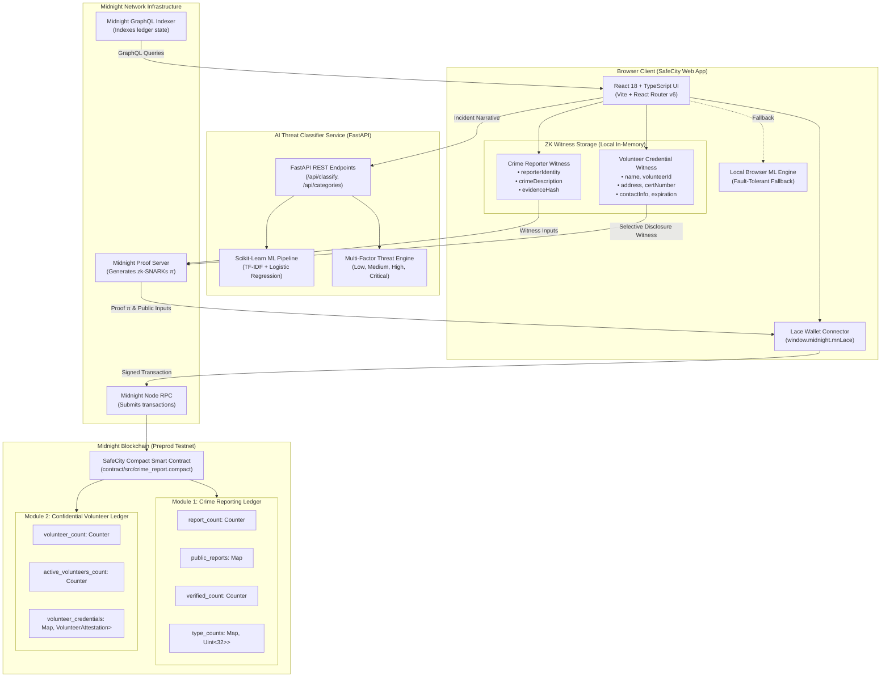

# 🏛️ SafeCity Platform Architecture & Data Flow

Detailed architectural documentation for the **SafeCity Multi-Module Public Safety Platform** on Midnight Blockchain.

---

## 1. High-Level Architecture Diagram



---

## 2. Platform Modules Overview

SafeCity operates two cryptographically isolated zero-knowledge modules on the same smart contract infrastructure:

### Module 1: Anonymous Crime Reporting & AI Classifier
- **Whistleblower Anonymity**: Citizens submit reports with cryptographic proof of submission without logging their wallet address, identity, or raw description on-chain.
- **AI Triage & Categorization**: Real-time evaluation of incident severity, crime taxonomy (Theft, Assault, Cyber Crime, Fraud, Vandalism), and multi-factor threat indicators.
- **Decentralized Corroboration**: Community members attest and upvote legitimate incidents anonymously.

### Module 2: Confidential Volunteer Verification (Selective Disclosure)
- **Credential Privacy**: Registered emergency medics, disaster relief volunteers, and neighborhood watch leaders verify their credentials on-chain without doxxing themselves.
- **Zero Information Leakage**: The circuit hides:
  - ❌ Volunteer Name
  - ❌ Volunteer ID
  - ❌ Residential Address
  - ❌ Official Certificate Number
  - ❌ Phone Number & Email
- **Selective Disclosure Output**: Only two public booleans are revealed:
  - ✅ **Verified / Not Verified**: Credential integrity and authority signature validity.
  - ✅ **Certification Active / Expired**: `is_active = (expiration_timestamp >= current_time)`.

---

## 3. End-to-End Selective Disclosure Flow (Module 2)

```
┌────────────────────────────────────────────────────────────────────────┐
│                        VOLUNTEER DEVICE (BROWSER)                      │
│                                                                        │
│  [Private Credential Attributes]                                       │
│  • Legal Name: "Sarah M. Jenkins"                                      │
│  • Volunteer ID: "VOL-EMERG-2024-8841"                                 │
│  • Address: "742 Evergreen Terrace, Metro City"                        │
│  • Certificate Number: "CERT-CPR-AED-992014"                           │
│  • Contact Info: "+1 (555) 234-8901"                                   │
│  • Expiration Date: 2028-06-30 (Timestamp: 1845936000)                │
│                                                                        │
│  1. Compute Deterministic Commitment:                                  │
│     C = SHA-256(Name || VolID || Addr || CertNo || Contact || Salt)   │
│                                                                        │
│  2. Load into Midnight Private State Witnesses:                        │
│     witness volunteerName(): Bytes<32>                                 │
│     witness volunteerId(): Bytes<32>                                   │
│     witness volunteerAddress(): Bytes<64>                              │
│     witness certificateNumber(): Bytes<32>                             │
│     witness contactInfo(): Bytes<32>                                   │
│     witness credentialExpiration(): Uint<64>                           │
└───────────────────────────────────┬────────────────────────────────────┘
                                    │
                                    ▼
┌────────────────────────────────────────────────────────────────────────┐
│                        MIDNIGHT PROOF SERVER                           │
│                                                                        │
│  Evaluates Circuit: proveVolunteerEligibility(commitment, currentTime) │
│                                                                        │
│  Cryptographic Constraints:                                            │
│  • Proves witness fields correctly hash to commitment C                │
│  • Evaluates is_active = (credentialExpiration() >= currentTime)       │
│                                                                        │
│  Outputs zk-SNARK Proof π (Hides all 5 private PII attributes)         │
└───────────────────────────────────┬────────────────────────────────────┘
                                    │
                                    ▼
┌────────────────────────────────────────────────────────────────────────┐
│                     ON-CHAIN MIDNIGHT PREPROD LEDGER                   │
│                                                                        │
│  Public State Written to Map<Bytes<32>, VolunteerAttestation>:         │
│  • commitment: 0x9f8b...32bytes                                        │
│  • attested_at: 1727395200                                             │
│  • is_verified: true                                                   │
│  • is_active: true (or false if expired)                               │
│                                                                        │
│  PUBLIC DISCLOSURE AUDIT:                                              │
│  • Verified Status:         [ VERIFIED ]                               │
│  • Certification Validity:  [ ACTIVE / EXPIRED ]                       │
│  • Personal Information:    [ 100% CONCEALED ]                         │
└────────────────────────────────────────────────────────────────────────┘
```

---

## 4. Privacy & State Isolation Matrix

| Platform Dimension | Sensitive Attributes (Witness Private State) | Public On-Chain Ledger (Public State) |
|---|---|---|
| **Module 1: Crime Reporting** | • Reporter wallet address<br>• Incident location coordinates<br>• Raw description text<br>• Raw evidence files | • Auto-incremented `report_id`<br>• Verified status (`0=Pending`, `1=Verified`, `2=Rejected`)<br>• Block timestamp<br>• Crime taxonomy enum (`Theft`, `Assault`, etc.) |
| **Module 2: Volunteer Verification** | • Volunteer full legal name<br>• Official volunteer ID number<br>• Residential address<br>• Professional certificate number<br>• Contact phone & email<br>• Exact expiration timestamp | • Credential commitment hash (32 bytes)<br>• **`is_verified`** (boolean)<br>• **`is_active`** (boolean: Active vs Expired)<br>• Attestation timestamp |

---

## 5. Smart Contract Circuits (Compact)

The smart contract is written in Midnight's native **Compact** language located at `contract/src/crime_report.compact`.

### Module 1 Circuits

#### `submitCrimeReport`
```compact
export circuit submitCrimeReport(
  crime_type: Uint<8>,
  date_timestamp: Uint<64>,
  has_evidence: Boolean
): Field
```
Verifies reporter identity and evidence hash against private witnesses, increments report counter, and stores `PublicReport` metadata.

#### `verifyReport`
```compact
export circuit verifyReport(report_id: Field): Boolean
```
Marks an existing report as verified on-chain and increments `verified_count`.

#### `getReportStatus`
```compact
export circuit getReportStatus(report_id: Field): Uint<8>
```
Read-only query circuit returning numeric verification code.

#### `upvoteReport`
```compact
export circuit upvoteReport(report_id: Field): Uint<32>
```
Community corroboration circuit incrementing endorsement count.

---

### Module 2 Circuits (Confidential Volunteer Verification)

#### `registerVolunteerCredential`
```compact
export circuit registerVolunteerCredential(
  commitment: Bytes<32>,
  attested_at: Uint<64>
): Bytes<32>
```
Registers an authorized credential commitment on-chain. Evaluates that the commitment hash is non-zero, increments `volunteer_count` and `active_volunteers_count`, and stores the `VolunteerAttestation` struct.

#### `proveVolunteerEligibility`
```compact
export circuit proveVolunteerEligibility(
  commitment: Bytes<32>,
  current_time: Uint<64>
): Boolean
```
Enforces **selective disclosure**:
1. Checks that the credential commitment exists on the public ledger.
2. Reads private witnesses `credentialExpiration()`, `volunteerName()`, etc.
3. Computes `is_active = (credentialExpiration() >= current_time)` inside the circuit.
4. Updates ledger status while revealing **only** `is_verified` and `is_active`.

#### `getVolunteerStatus`
```compact
export circuit getVolunteerStatus(commitment: Bytes<32>): Boolean
```
Public query circuit enabling coordinators, emergency dispatchers, or law enforcement to verify credential validity in $O(1)$ lookup time without possessing personal volunteer data.

---

## 6. AI Crime Classifier Architecture

The machine learning subsystem operates as a high-throughput microservice:

```
[ Raw Incident Text ]
          │
          ▼
[ Text Normalization & Lowercasing ]
          │
          ▼
[ TfidfVectorizer: N-grams (1, 2) + Sublinear TF Scaling ]
          │
          ▼
[ Multi-Class Logistic Regression (Class-Weighted Balanced) ]
          │
          ▼
[ Multi-Class Temperature Calibration (T = 0.5) ]
          │
     ┌────┴───────────────────────────────┐
     ▼                                    ▼
[ Predicted Category ]       [ Multi-Factor Risk Scorer ]
(Theft, Assault,             (Base Category Risk Weight +
 Cyber Crime, Fraud,          Critical Threat Indicators +
 Vandalism)                   High Severity Modifiers)
     │                                    │
     └────────────────┬───────────────────┘
                      ▼
            [ ClassifyResponse ]
            • category
            • category_id
            • risk_level
            • confidence
            • probabilities
            • risk_factors
            • explanation
```
