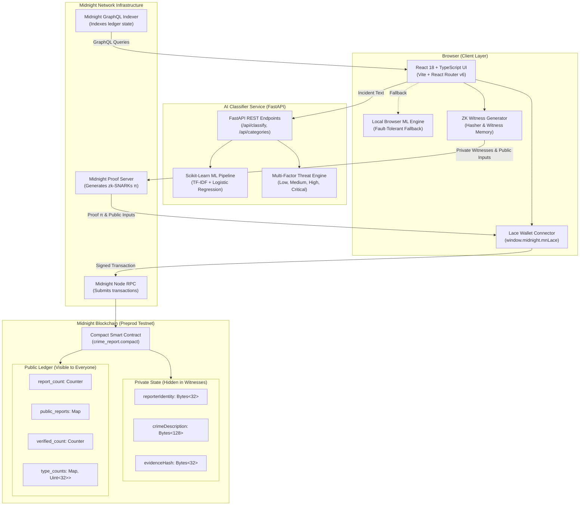

# 🏛️ System Architecture & Data Flow

Detailed architectural documentation for the **Anonymous Crime Reporting & Verification DApp** on Midnight Blockchain.

---

## 1. High-Level Architecture Diagram



---

## 2. End-to-End Zero-Knowledge Data Flow

```
1. USER ENTERS INCIDENT
   │
   ├─► Crime Type, Date, Location, Description, Evidence Hash
   │
2. AI CLASSIFIER ASSISTANCE (Real-Time)
   │
   ├─► POST /api/classify
   ├─► Predicts category (Theft, Assault, Cyber Crime, Fraud, Vandalism)
   ├─► Calculates calibrated confidence score (0.0 to 1.0)
   └─► Assesses risk severity (Low, Medium, High, Critical)
   │
3. CLIENT-SIDE WITNESS PACKING (Stays inside user browser)
   │
   ├─► reporterIdentity = SHA256(userWalletAddress || salt)
   ├─► crimeDescription = SHA256(rawDescription)
   └─► evidenceHash     = IPFS CID or SHA256(evidence)
   │
4. PROOF GENERATION (Zero-Knowledge)
   │
   ├─► Client sends witnesses + public parameters to Midnight Proof Server
   └─► Generates zk-SNARK proof π (approx. 1,480 bytes) in ~1.8 seconds
   │
5. ON-CHAIN TRANSACTION (Midnight Preprod)
   │
   ├─► Lace Wallet signs transaction containing ONLY:
   │     • ZK Proof π
   │     • Public Inputs: reportId, crimeType, timestamp, hasEvidence
   └─► Node verifies π on-chain:
         "Proves report is validly formatted WITHOUT revealing reporterIdentity"
   │
6. PUBLIC VERIFICATION
   │
   └─► Anyone can call verifyReport(reportId) or check status on-chain.
```

---

## 3. Private State vs Public Ledger Matrix

| Field | Storage Location | Accessibility | Cryptographic Protection |
|---|---|---|---|
| **Reporter Identity** | Private Witness | Private to submitter | Hashed in witness; never broadcasted |
| **Incident Description** | Private Witness | Private to submitter | Hashed in witness; never visible on-chain |
| **Exact Location** | Private Witness | Private to submitter | Hashed locally in browser |
| **Evidence Hash** | Private Witness | Private to submitter | Stored in witness / IPFS CID |
| **Report ID** | Public Ledger | Public | Auto-incremented sequence number |
| **Crime Type** | Public Ledger | Public | Enum integer (`1..5`) |
| **Submission Timestamp** | Public Ledger | Public | Unix milliseconds timestamp |
| **Verification Status** | Public Ledger | Public | `Pending (0)`, `Verified (1)`, `Rejected (2)`, `Investigating (3)` |
| **Community Upvotes** | Public Ledger | Public | Attested upvote counter |

---

## 4. Smart Contract Circuits

The contract is written in Midnight's native **Compact** smart contract language (`contract/src/crime_report.compact`).

### Circuit 1: `submitCrimeReport`
```compact
export circuit submitCrimeReport(
  crime_type: Uint<8>,
  date_timestamp: Uint<64>,
  has_evidence: Boolean
): Field
```
- Receives non-identifying public inputs.
- Validates inputs against private witnesses `reporterIdentity()`, `crimeDescription()`, and `evidenceHash()`.
- Increments `report_count`.
- Writes new `PublicReport` struct to on-chain ledger map.
- Emits the newly generated `reportId`.

### Circuit 2: `verifyReport`
```compact
export circuit verifyReport(report_id: Field): Boolean
```
- Fetches `PublicReport` by ID from ledger state.
- Asserts report exists on-chain.
- Updates verification status to `Verified (1)`.
- Increments `verified_count`.
- Returns `true`.

### Circuit 3: `getReportStatus`
```compact
export circuit getReportStatus(report_id: Field): Uint<8>
```
- Read-only circuit returning numeric status code for any given report ID.

### Circuit 4: `upvoteReport`
```compact
export circuit upvoteReport(report_id: Field): Uint<32>
```
- Increments community endorsement counter for confirmed reports.

---

## 5. Machine Learning Pipeline Architecture

The AI Crime Classifier backend uses a decoupled, stateless microservice architecture:

```
[ Unstructured Text ]
         │
         ▼
[ Text Normalization & Lowercasing ]
         │
         ▼
[ TfidfVectorizer: N-grams (1, 2) + Sublinear TF Scaling ]
         │
         ▼
[ Multi-Class Logistic Regression (Class-Weighted Balanced) ]
         │
         ▼
[ Multi-Class Temperature Calibration (T = 0.5) ]
         │
    ┌────┴───────────────────────────────┐
    ▼                                    ▼
[ Predicted Category ]       [ Multi-Factor Risk Scorer ]
(Theft, Assault,             (Base Category Risk Weight +
 Cyber Crime, Fraud,          Critical Threat Indicators +
 Vandalism)                   High Severity Modifiers)
    │                                    │
    └────────────────┬───────────────────┘
                     ▼
           [ ClassifyResponse ]
           • category
           • category_id
           • risk_level
           • confidence
           • probabilities
           • risk_factors
           • explanation
```
